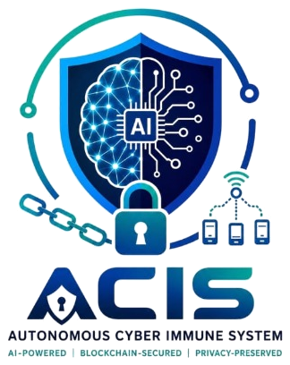

<div align="center">
  
  <h1>ACIS-Core</h1>
  <p><strong>Autonomous Cyberimmune System | AI-Powered • Blockchain-Secured • Privacy-Preserved</strong></p>
</div>

ACIS-Core is an advanced, autonomous cyberimmune system dashboard and secure authentication gateway for real-time threat monitoring, AI model controls, and trust ledger verification.

---

## 🚀 Key Features

* **Secure Operator Authentication**: Light/Dark theme-aligned login interface with role clearance selection and offline demo access.
* **Real-time Cyberimmune Dashboard**: Monitor blocked threats, AI decisions, uptime metrics, and session security.
* **AI Model Controls**: Instant execution and visualization for Threat Detection, Federated Learning, Autoencoder Anomaly Scoring, and SHAP feature importance.
* **Trust Ledger**: Cryptographic audit trail for verified operational security events.
* **Dual-Mode Backend Resilience**: Seamless local demo authentication fallback when backend server is offline.

---

## 🛠️ Technology Stack

* **Frontend**: HTML5, Vanilla CSS (Custom Design System with Light/Dark Themes), JavaScript (ES6+)
* **Icons & Fonts**: FontAwesome 6, Google Fonts (`Inter`, `JetBrains Mono`)
* **Visualization**: Chart.js
* **Backend Integration**: RESTful API endpoint (`http://127.0.0.1:5001/api/login`) with graceful offline fallback

---

## 💻 How to Run Locally

1. **Clone the repository**:
   ```bash
   git clone https://github.com/your-username/acis-core.git
   cd acis-core
   ```

2. **Open in Browser**:
   * Open `login.html` using VS Code **Live Server** or simply double-click `login.html` to launch in your browser.

3. **Default Operator Credentials**:
   * **Operator Email**: `admin@cyberimmune.ai`
   * **Password**: `SecurePass123`
   * **Role**: `SecOps Administrator (Level 5)`

---

## 🚀 24/7 Production Deployment Guide

### 1. Backend Deployment (Render.com)
1. Sign in to [Render.com](https://render.com) and click **New > Web Service**.
2. Connect your GitHub repository: `https://github.com/yogitaalone04-web/ACIS-Core.git`.
3. Configure the service:
   - **Name**: `acis-core-backend`
   - **Root Directory**: (Leave blank or `.`)
   - **Environment**: `Python 3`
   - **Build Command**: `pip install -r backend/requirements.txt`
   - **Start Command**: `cd backend && gunicorn --bind 0.0.0.0:$PORT --workers 1 --threads 8 --timeout 120 "app:app"`
   - **Plan**: `Free`
4. Click **Create Web Service**. Once deployed, copy your service URL (e.g. `https://acis-core-backend.onrender.com`).
5. (Optional) Alternatively, use **New > Blueprint** and select `render.yaml` directly!

### 2. Frontend Deployment (Vercel)
1. Sign in to [Vercel.com](https://vercel.com) and click **Add New > Project**.
2. Import the `ACIS-Core` repository.
3. Configure the project:
   - **Framework Preset**: `Other`
   - **Root Directory**: `./`
   - **Build & Output Settings**: Default (static HTML/CSS/JS)
4. Click **Deploy**. Vercel will instantly publish your dashboard (e.g. `https://acis-core.vercel.app`).

### 3. Connect Frontend to Live Render Backend
- Open your deployed Vercel URL.
- Tap the **Connected (2s)** status badge in the top header.
- The **SOC Cloud Connection** modal opens: verify or enter your Render backend URL (e.g. `https://acis-core-backend.onrender.com/api`).
- Click **Save & Reconnect**. The frontend immediately begins 24/7 live SSE streaming!

---

## 📂 Project Structure

```text
ACIS-Core/
├── assets/                  # Official ACIS logos, transparent emblems, & favicons
├── backend/
│   ├── models/              # Modular AI/ML threat classifiers & digital twin
│   ├── acis_database.db     # SQLite SOAR incident store & audit log
│   ├── app.py               # REST API & SSE streaming server
│   ├── Procfile             # Process configuration for cloud deployment
│   └── requirements.txt     # Production dependencies including Gunicorn
├── css/
│   ├── style.css            # Enterprise SOC design tokens (Dark/Light) & responsive layouts
│   └── login.css            # Authentication gateway stylesheet
├── js/
│   ├── config.js            # Dynamic cloud/local environment resolver
│   └── digitalTwin.js       # Real-time infrastructure canvas & SSE consumer
├── .github/workflows/
│   └── keep-alive.yml       # 10-minute automated ping workflow to prevent Render sleep
├── index.html               # Autonomous Cyberimmune SOC Dashboard
├── login.html               # Operator Authentication Gateway
├── render.yaml              # Render blueprint specification
└── vercel.json              # Vercel production hosting & routing rules
```

## 👤 Author & Contribution

Developed as part of the ACIS-Core Autonomous Cyberimmune initiative.
